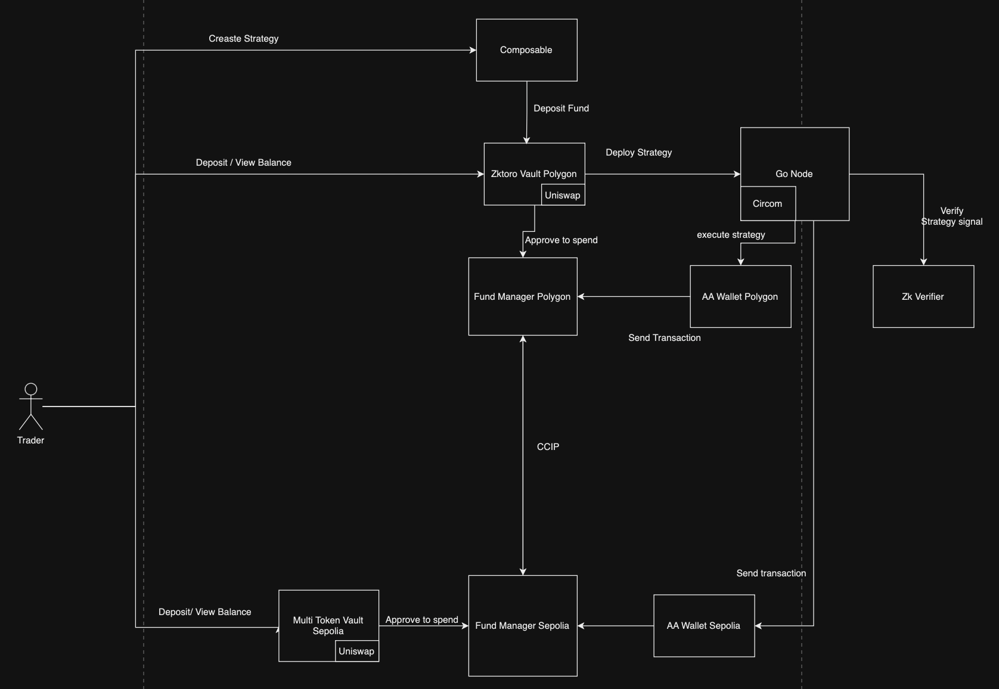

# Chainlink Constellation Hackathon Project

## Overview

Welcome to the repository for our Chainlink Constellation Hackathon Project! This project is developed as part of the hackathon happening from November 9th to December 10th.

## Project Description

zkToro is a DeFi protocol that provides the critical infrastructure to create, share and execute investable crypto quant trading strategies cross-chain - all whilst preserving the IP of the expert strategies private off and on-chain.

“Success spreads, secrets stay”

## High-level Architecture



## Demo

Include a link or embed a demo video showcasing your project in action. Screenshots or GIFs can also be added to give a visual representation.

## Features

List the main features of zkToro project:

- User create strategies with drap & drop UX: Users can create quant trading strategies with an easy UX, made with Next.js.
- Executable strategies: Strategies will be parsed to code in order to be executed by our L3.
- Strategy verification: Strategies signals are verified with Zk proofs.
- Dockerized strategies: Strategies are dockerized and executed in the backend.
- Automated swaps and cross-chain operations: Desired swaps will take place in UniSwap and tokens will be bridged between chains.

## Technologies Used

- Chainlink CCIP
- Tencent Cloud Infraestructe
- Account Abstraction
- Circom (Zk Proofs)
- Next.js
- Javascript
- Typescript
- Docker
- Go

## Getting Started

### Prerequisites

Specify any software, tools, or dependencies that need to be installed before running the project.

### Installation

In order to start the backend:

```bash
## Download desired certificate to run backend

# Login to server
chmod 400 zktoro.pem
ssh -i zktoro.pem ubuntu@43.156.147.65

#Whenever login, first
source ~/.profile

# Run backend node server
cd ~/zktoro_node_endpoint
ts-node index.ts

# fetch image and run 
cd ~/pull_and_exec
```
In order to start the backend:

```bash
# Commands to run frontend server (Leo)
```


